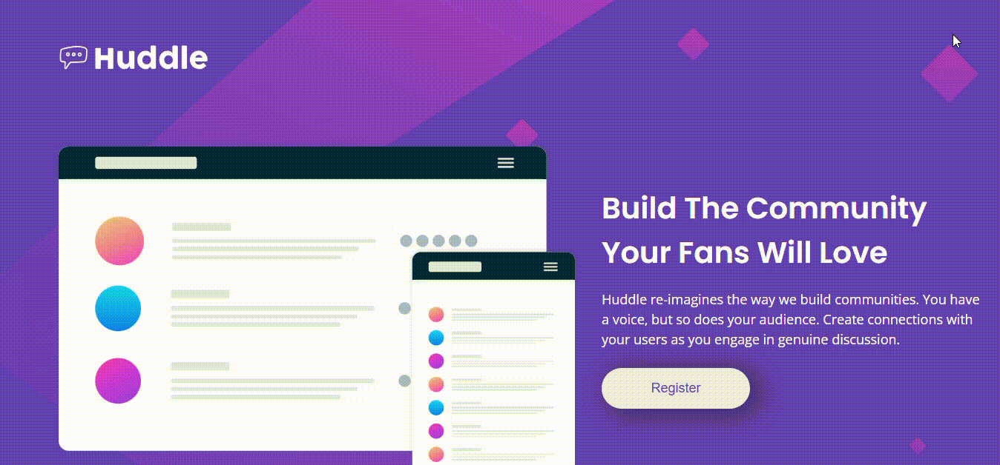
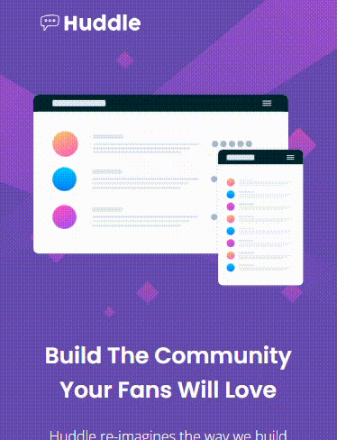

## Projeto HTML Avançado e CSS Avançado do curso Dev Quest. 

Landing page criada utilizando conhecimentos de HTML e CSS, com design web e responsivo fornecidos pelo Frontend Mentor.

Medidas utilizadas para o responsivo foram baseadas em imagem de background, fornecidas para o projeto, de 375px para visualização em aparelhos celulares. 

### Tecnologias Utilizadas

- HTML
- CSS
